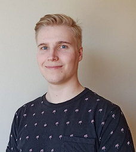

# About me

My name is Eetu Ihalainen and I am a 23-year-old game programmer student from Tampere. My strengths are with Unity and C# programming. I also know the basics of Unreal Engine 4 and C++.

*   [LinkedIn](https://www.linkedin.com/in/eetu-ihalainen/)
*   [GitHub](https://github.com/Eetui)

## Projects:

Links below leads you to their corresponding pages.

*   [Object Interactions](./objectinteractions-page.html).
