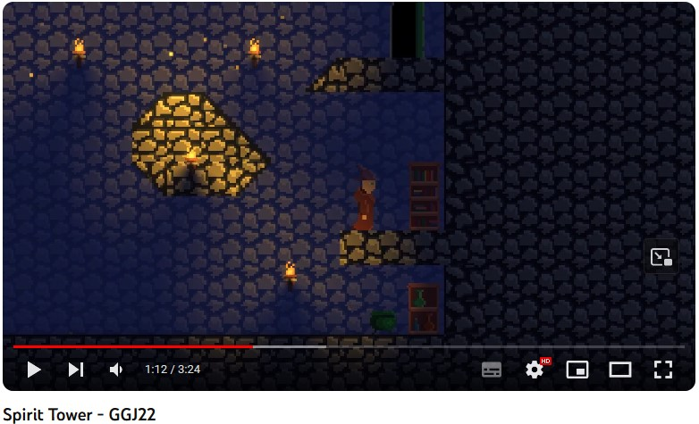
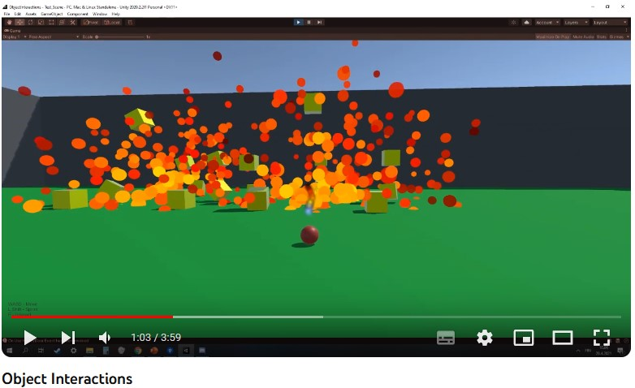
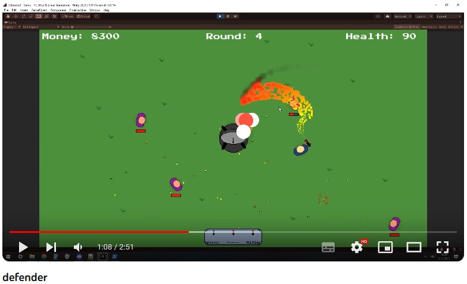
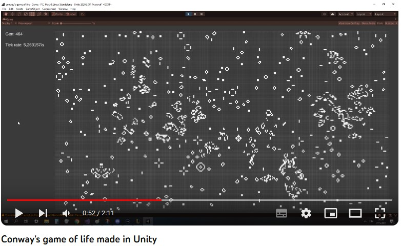
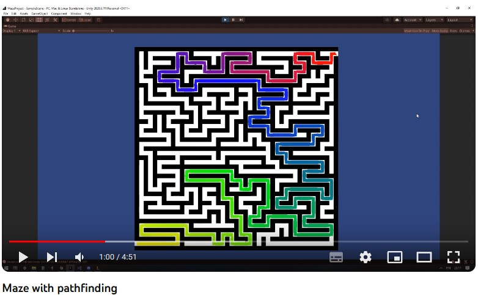

# Eetu Ihalainen - About me

Last update 17.10.23

I am a game developer with a Bachelor’s Degree in Business Information Technology from JAMK, where I graduated in December 2022. Since January 2022, I have been employed at Zaibatsu Interactive Oy. My professional expertise lies in Unity and C# programming, and I am highly motivated to continually enhance my skills and remain informed about the most recent developments in the industry. I am committed to learning new technologies and techniques to further advance my career.

* Expertice 
  * C#, Unity, Git, GitHub, Bitbucket, Jira, Trello
* Currently learning
  * ASP.NET.Core, React and web development as a whole
* Other skills 
  * HTML, CSS, JavaScript, Unreal Engine 4, C++, Blender

Languages: Finnish (Native), Working proficiency in English.

Also I love to play competitive games like Chess, CS2 , Valorant and League of Legends.

### Social

*   [LinkedIn](https://www.linkedin.com/in/eetu-ihalainen/)
*   [GitHub](https://github.com/Eetui)

## Projects 

At Zaibatsu I've been part of multiple projects

* [Super Spatial](https://www.superspatial.com/)
  * Super Spatial was a large-scale development project aimed at creating an immersive social MMO game for mobile platforms. As a client-side developer, I collaborated with a multidisciplinary team, including designers and backend developers. My responsibilities included fixing bugs and implementing new features to the game.
* [Boom Karts](https://play.google.com/store/apps/details?id=com.fingersoft.boomkarts)
  * Boom Karts was a fast-paced multiplayer racing game developed for mobile platforms. I was part of a large development team, focusing on client-side development. My responsibilities included implementing dynamic UI elements, fixing bugs and to enhance the overall gaming experience.
* [Ahh Chute](https://play.google.com/store/apps/details?id=com.resdevproductions.ahhchute)
  * Ahh Chute was an exciting mobile game project that challenged players to navigate through a series of obstacles while freefalling. As the sole programmer in a small team, I took on a diverse range of tasks.
* I was also part of smaller projects, for example I made training simulator that was embedded in LMS (Moodle).
  * My [Thesis](https://www.theseus.fi/bitstream/handle/10024/786952/Thesis_Ihalainen_Eetu.pdf?sequence=2&isAllowed=y) goes in depth about this subject.

## Older Projects:

*   [Object Interactions](./objectinteractions-page.html) <---- Good explanations with examples, check this!
*   [Defender](https://github.com/Eetui/Defender2) (Repo link)
*   [Conway's game of life](https://github.com/Eetui/GameOfLife) (Repo link)
*   [Maze generator with pathfinding](https://github.com/Eetui/MazeWithPathfinding) (Repo link)
*   [GGJ2021 - The Lost Passangers](https://globalgamejam.org/2021/games/lost-passengers-5)

