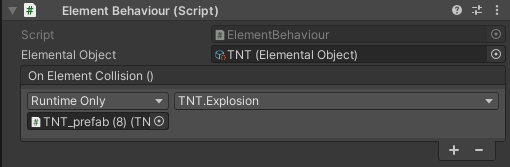

[Front page](./index.html)

# Object Interactions

Is a project where the player is controlled from a first-person perspective and player can interact with different objects.

I did this project for Advanced Game Programming -course.

[Link to Object Interactions GitHub](https://github.com/Eetui/ObjectInteractions) (Will be updated soon)

## Goals of the course

My goal was to write modular and cleaner code.

## What did I learn?

I fulfilled my goal and managed to write modular and cleaner code. I learned SOLID-principles on some level and how to implement them into my code. I also learned how to implement events with Scriptable Objects and how to use Scriptable Objects overall. In addition I used interfaces on this project and became more familiar with them. And thousand little things what comes when making a project.

## Code

### Player Controls

First thing I implemented was the player controls. It was done with Unitys old input system and CharacterController.

#### PlayerMovement.cs

```cs
private void Update()
{
    speed = Input.GetKey(KeyCode.LeftShift) ? runningSpeed : walkingSpeed;
    Vector2 movementInput = new Vector2(Input.GetAxisRaw("Horizontal"), Input.GetAxisRaw("Vertical"));

    movementInput.Normalize(); // Normalizing the input so walking diagonally isn't faster.

    if (groundCheck.IsGrounded() && velocity.y < 0f) velocity.y = -1f;

    velocity.y += gravity * Time.deltaTime; // Falling speed increases overtime. if check above resets this if grounded.

    Vector3 movement = ((transform.forward * movementInput.y) + (transform.right * movementInput.x)) * speed + (Vector3.up * velocity.y);
    characterController.Move(movement * Time.deltaTime);
}
```

#### PlayerLook.cs

```cs
private void Update()
{
    Vector2 mouseInput = new Vector2(Input.GetAxis("Mouse X"), Input.GetAxis("Mouse Y"));
    
    CalculateCameraPitch(mouseInput.y);

    //yaw
    transform.Rotate(Vector3.up * mouseInput.x * sensitivity);
}

private void CalculateCameraPitch(float mouseInputY)
{
    if (invertedLook) cameraPitch += mouseInputY * sensitivity;
    else cameraPitch -= mouseInputY * sensitivity;

    cameraPitch = Mathf.Clamp(cameraPitch, -90f, 90f);
    
    playerCamera.localEulerAngles = Vector3.right * cameraPitch;
}
```

### Interactables

All interactable objects inherit IInteractable interface. IInteractable methdos are called from PlayerInteract class, which is attached to the player.

#### IInteractable.cs

```cs
public interface IInteractable
{
    string GetInteractionText();
    void Interact();
}
```

Example class that inherits IInteractable

#### InteractableDoor.cs

```cs
public class InteractableDoor : Door, IInteractable
{
    public string GetInteractionText() => isDoorOpen ? "Open Door" : "Close Door";

    public void Interact() => UseDoor();
}
```


All this is possible because of the PlayerInteract class that I mentioned earlier.

#### PlayerInteract.cs

```cs

public IInteractable interactable = null; // interactable variable

... // skipping some code

private void Update()
{
    interactable = null;

    Physics.Raycast(camTransform.position, camTransform.TransformDirection(Vector3.forward), out var hit, interactRange, interactableLayerMask);
    var hitTransform = hit.transform;

    if (hitTransform != null)
    {
        if (hitTransform.TryGetComponent(out interactable) && groundCheck.IsGrounded())
        {
            if (Input.GetKeyDown(interactionKey))
            {
                interactable.Interact();
                onInteractionChanged?.Invoke();
            }
        }
    }
... // code goes on

```

PlayerInteract is shooting a ray and if the ray hits some object, it will look if the object inherits IInteractable. If the object inherits from IInteractable it will store the information to variable called interactable. Then if player presses the interaction key, it will call the objects IInteractable interact method.

For example if the player looks at the InteractableDoor, the PlayerInteract script will look ```if (hitTransform.TryGetComponent(out interactable)``` if the InteractableDoor has inherited the IInteraction interface and since it has, the PlayerInteract script will continue and wait for the player input  ```if (Input.GetKeyDown(interactionKey))```. Then the player presses the interaction key and the PlayerInteract script will call the InteractableDoor's Interact method ```interactable.Interact();```, which will call the UseDoor method ```public void Interact() => UseDoor();``` and the door opens.

### UI

Player needs some kind of indication that the object the is looking is interactable. In this project that is done with the UI. You might be able to see this in the gif above.

The IInteractable interface has GetInteractionText method that returns a string. This is used with the UIInteract class. When player presses the interaction key an event is invoked. ```onInteractionChanged?.Invoke();```

```onInteractionChanged?.Invoke();``` Event will call UIInteraction's ```UpdateInteractionUI()``` method, which will update the text ```interactionText.text = player.interactable.GetInteractionText();```. ```UpdateInteractionUI()``` method will also enable or disable the UI depending if the player.interactable is null or not.

We will go through the event system later.

#### UIInteract.cs

```cs
public class UIInteract : MonoBehaviour
{
    [SerializeField] private PlayerInteract player;

    [Header("Interaction")]
    [SerializeField] private GameObject interactPanel;
    [SerializeField] private Text interactKeyText;
    [SerializeField] private Text interactionText;
    private string interactionKey;

    private void Start() => interactionKey = player.InteractionKey.ToString();

    public void UpdateInteractionUI()
    {
        if (player.interactable != null)
        {
            interactionText.text = player.interactable.GetInteractionText();
            interactKeyText.text = interactionKey;
            interactPanel.SetActive(true);
        }
        else
        {
            interactPanel.SetActive(false);
        }
    }
}
```
### Pickable Objects

All pickable objects inherit the IInteractable interface. Also they inherit IThrowable interface which almost identical with IInteractable so I won't be going over it here. In the ```Start()``` method every pickable object will try to find PickUpPoint ```pickUpPoint = GameObject.Find("PickUpPoint").gameObject;```. PickUpPoint is an empty gameobject  which is a player's childobject.


### ScriptableObject Event System

This system has two parts GameEvent.cs, which is a ScriptableObject and GameEventListener.cs, which will be attached to a gameobject. To create a new game event we have to go to the Assets/Create submenu and click "New Game Event". To add it there we have to use ```[CreateAssetMenu(menuName = "Eetu/Game Event", fileName = "New Game Event")]``` attribute.

In GameEvent.cs we have a list ```private List<GameEventListener> listeners``` that will contain every GameEventListener. To add GameEventListener to the list we call the GameEvent class' ```public void AddListener(GameEventListener gameEventListener)``` method in GameEventListener's Awake method like this ```private void Awake() => gameEvent.AddListener(this);```.

Game event can have multiple listeners and to invoke all listeners use the ```public void Invoke()``` method to do so. ```public void Invoke()``` method will go through the list of GameListeners with a foreach loop and call ```TriggerEvent()``` method in each listener. ```TriggerEvent()``` method will trigger a UnityEvent and everything assigned to it in the editor. Examples below the code.

#### GameEvent.cs

```cs
[CreateAssetMenu(menuName = "Eetu/Game Event", fileName = "New Game Event")]
public class GameEvent : ScriptableObject
{
    private List<GameEventListener> listeners = new List<GameEventListener>();

    public void Invoke()
    {
        foreach (var listener in listeners)
        {
            listener.TriggerEvent();
            //Debug.Log($"{name} Event has been invoked", this);
        }
    }

    public void AddListener(GameEventListener gameEventListener) => listeners.Add(gameEventListener);

    public void RemoveListener(GameEventListener gameEventListener) => listeners.Remove(gameEventListener);
}
```

#### GameEventListener.cs

```cs
public class GameEventListener : MonoBehaviour
{
    [SerializeField] private GameEvent gameEvent;
    [SerializeField] private UnityEvent unityEvent;

    private void Awake() => gameEvent.AddListener(this);

    private void OnDestroy() => gameEvent.RemoveListener(this);

    public void TriggerEvent() => unityEvent?.Invoke();
}
```

### ScriptableObject Event System Examples

In this simple example we have a Hoop class that will invoke a GameEvent when an object collides with a trigger.

#### Hoop.cs
```cs
public class Hoop : MonoBehaviour
{
    [SerializeField] private GameEvent gameEvent;

    private void OnTriggerEnter(Collider col) => gameEvent?.Invoke();
}
```


GameEvent can be assigned to the Hoop class in the inspector. In this case GameEvent is "On Score Hoop"


Then we have a door prefab that has a GameEventListener attached to it. As you can see we invoke the UnityEvent which will call the Door's ```UseDoor()``` method when the "On Score Hoop" GameEvent gets invoked.


And BOOM door is open!

### Elements

This system is based on ScriptableObejects. ElementalObject.cs has a public list that will contain every element that it is going to interact with and it is going to be a ScriptableObject.

ElementBehaviour.cs has a reference to the ElementalObject and it also has an UnityEvent. The UnityEvent will trigger when an object collides with it and the object has ElementalBehaviour attached to it. Also the object has be included in the ElementalObject's list.

#### ElementalObject.cs

```cs
[CreateAssetMenu(menuName = "Eetu/ElementalObject", fileName = "ElementalObject")]
public class ElementalObject : ScriptableObject
{
    public List<ElementalObject> ElementsToInteractWith = new List<ElementalObject>();
}
```

#### ElementBehaviour.cs

```cs
public class ElementBehaviour : MonoBehaviour
{
    public ElementalObject elementalObject;
    public UnityEvent OnElementCollision;

    public void SetElement(ElementalObject _elementalObject)
    {
        elementalObject = _elementalObject;
    }

    public virtual void OnCollisionEnter(Collision col)
    {
        if (col.gameObject.TryGetComponent(out ElementBehaviour colElement))
        {
            if (elementalObject.ElementsToInteractWith.Contains(colElement.elementalObject))
            {
                OnElementCollision?.Invoke();
            }
        }
    }
}
```

#### Elements Example TNT and Fireball


Here we have TNT element with Fire element included in it.



TNT's OnElementCollision event will trigger when an object with Fire element attached to it collides with the TNT (Fire element doesn't have to have TNT included in it). The UnityEvent will call for the TNT's Explosion method and an explosion happens.


